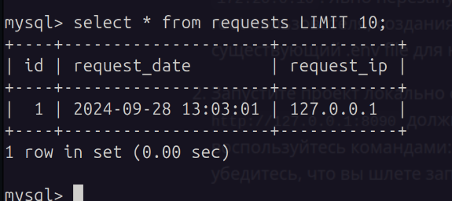
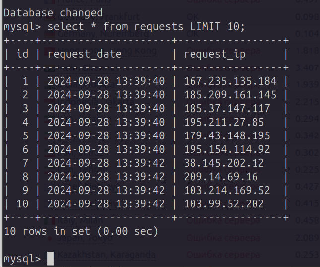
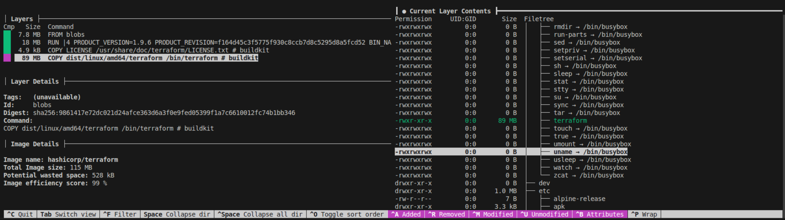
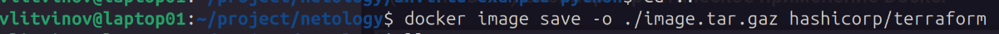
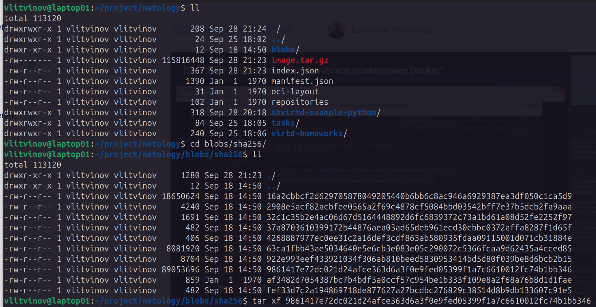
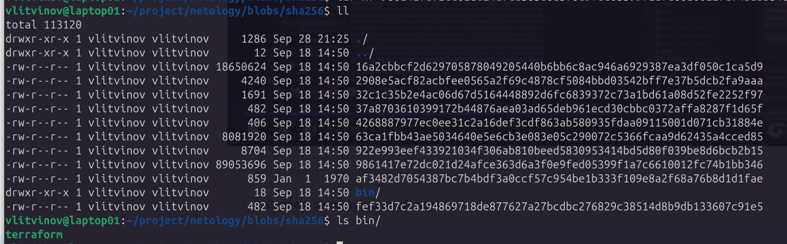
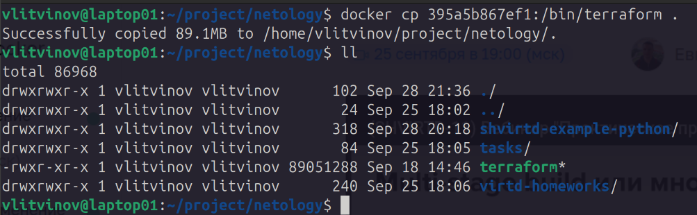

## Задача 1

```
FROM python:3.9-slim

WORKDIR /app

COPY . .

RUN pip install -r requirements.txt

CMD ["python", "main.py"]
```

## Задача 3

```
include:
  - ./proxy.yaml

services:
  web:
    depends_on: 
      db:
        condition: service_healthy
    image: shvirtd-example-python:0.0.1
    build: 
      context: .
      dockerfile: Dockerfile.python
    restart: on-failure
    networks:
      backend:
        ipv4_address: 172.20.0.5
    ports:
      - 5000
    environment:
      - DB_HOST=db
      - DB_USER=${MYSQL_USER}
      - DB_PASSWORD=${MYSQL_PASSWORD}
      - DB_NAME=${MYSQL_DATABASE}

  db:
    image: mysql:8
    restart: on-failure
    volumes:
      - db_data:/var/lib/mysql
    networks:
      backend:
        ipv4_address: 172.20.0.10
    ports:
      - 3306
    environment:
      - MYSQL_ROOT_PASSWORD=${MYSQL_ROOT_PASSWORD}
      - MYSQL_DATABASE=${MYSQL_DATABASE}
      - MYSQL_USER=${MYSQL_USER}
      - MYSQL_PASSWORD=${MYSQL_PASSWORD}
      - MYSQL_ROOT_HOST="%"
    healthcheck:
        test: ["CMD", "mysqladmin" ,"ping", "-h", "localhost"]
        timeout: 20s
        retries: 10
    

volumes:
  db_data: {}
```



## Задача 4

```
#!/bin/bash

cd /opt/
sudo git clone https://github.com/ltvnvv/shvirtd-example-python.git
cd /opt/shvirtd-example-python/
docker compose up
```



## Задача 6






## Задача 6.1

